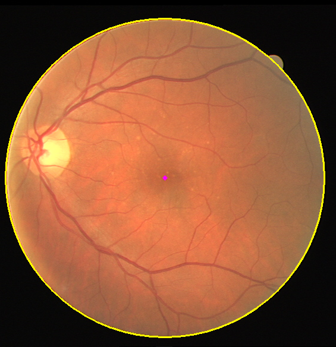

# Endoscopy Bounding Circle Detector
Extract the bounding circle from endoscopic images. Examples are shown for the [DRIVE](https://drive.grand-challenge.org/) and the [cholec80](http://camma.u-strasbg.fr/datasets) dataset, see below

<p align="center">
  
   
</p>

## Example
To run an example on video data, try
```shell
python vid_main.py  # runs for ~10s
```
To run an example on a single image, try
```shell
python img_main.py
```
